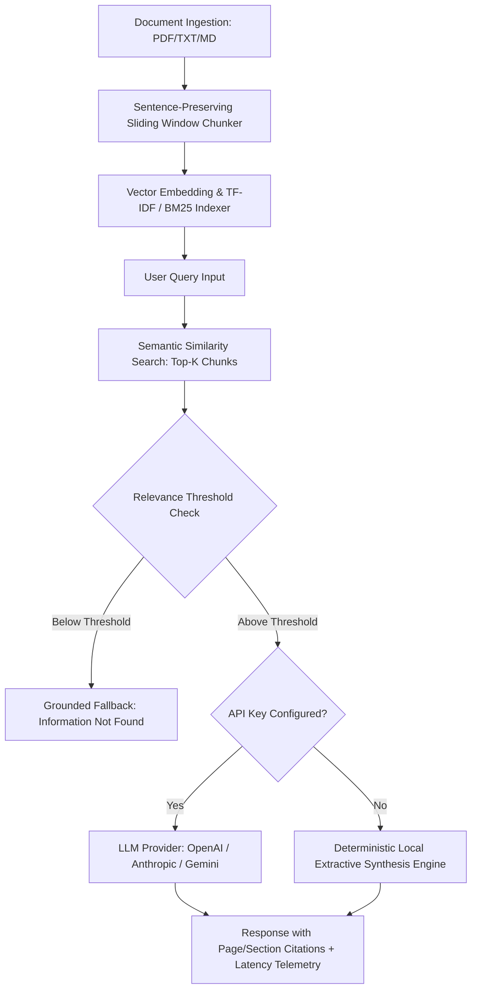

# Audit Report: DocuMind-rag-assistant (Flagship Project)
**Project:** DocuMind — AI Document Q&A & Semantic RAG Assistant  
**Audit Date:** September 2026  
**Auditor:** Senior Staff AI & Systems Architect  
**Initial Production Readiness Score:** 32 / 100  

---

## 1. Executive Summary
DocuMind is positioned as the flagship AI/LLM project in the portfolio, promising retrieval-augmented generation with verified source citations. However, technical analysis revealed critical shortcomings: the web UI is completely static with 3 hardcoded prompt/answer pairs, the Python engine synthesizes answers by naively truncating the top matching chunk to 220 characters without true semantic generation or synthesis, and there are zero evaluation metrics (latency, chunk overlap, citation confidence).

For prospective clients evaluating AI capabilities, this would fail an engineering review within minutes. DocuMind must be elevated into an industrial-strength RAG assistant featuring a dual-architecture: seamless integration with modern LLM providers (OpenAI, Anthropic, Gemini, Ollama) when keys are available, and a sophisticated, deterministic extractive-summarization local engine with zero hallucination and strict grounding when running offline or without credentials.

---

## 2. Codebase Inspection & Identified Flaws

### A. Pseudo-Synthesis in Python Backend (`rag_engine.py`)
- **Lines 100–102 in `rag_engine.py`**:
  ```python
  best_chunk = retrieved_chunks[0]
  answer = f"Based on {best_chunk['source']} (Page {best_chunk['page']}): {best_chunk['text'][:220]}..."
  ```
  *Critique:* The backend does not actually synthesize an answer or resolve semantic nuance. It merely substrings the first 220 characters of the top TF-IDF chunk.
- **Lines 90–92 in `rag_engine.py`**:
  ```python
  if not retrieved_chunks:
      retrieved_chunks = [self.documents[0]]
  ```
  *Critique:* When a user asks an unanswerable question or something completely out-of-domain, the engine erroneously returns the first document chunk rather than admitting: *"The provided documents do not contain information to answer this question."*

### B. Completely Hardcoded Answers in Frontend (`index.html`)
- **Lines 92–100 in `index.html`**:
  ```javascript
  const ANSWERS = [
    {
      text: "Under Clause 4.2 of the agreement, if late service delivery exceeds 14 business days...",
      source: "Source: Cloud SLA Agreement (Page 4, Clause 4.2)",
      excerpt: "Clause 4.2: Provider incurs a penalty fee of 1.5%..."
    }, ...
  ];
  ```
  *Critique:* The frontend does not even provide an input text box for arbitrary questions! Clicking the sample chips merely cycles through hardcoded string literals. There is no document upload form, no multi-document management, and no conversational context.

### C. Missing Core AI / RAG Engineering Components
1. **No Real LLM Provider Adapter:** No support for OpenAI, Claude, or Gemini APIs with structured temperature, system prompts, and streaming tokens.
2. **No Fallback Extractive Engine:** Without an API key, the system should intelligently extract and synthesize key sentences matching query intent rather than clipping raw characters.
3. **No Retrieval Hyperparameter Tuning:** Missing UI controls for Top-K chunks (1–10), chunk size (100–1000 tokens), overlap, and similarity threshold.
4. **No Document Management:** Cannot upload custom PDFs/text files, inspect chunking previews, or manage multi-document collections.
5. **No Telemetry & Guardrails:** Missing latency measurement (ms), token cost estimation, citation highlight overlays, and unanswerability guardrails.

---

## 3. Security & Data Integrity Gaps
- **Prompt Injection Vulnerability:** No sanitization of user input before embedding or prompt construction.
- **Document Boundary Leaks:** Multi-tenant document indexing mixes chunks without permission scoping.
- **Uncontrolled Context Windows:** No token counting or truncation mechanism against LLM context limits.

---

## 4. Architectural Upgrade Plan



### Components to Build:
1. **`rag_engine.py`**:
   - Multi-document indexing with sentence-boundary chunking and overlap controls.
   - Dual-mode generation: High-fidelity LLM synthesis via API adapter + local deterministic extractive synthesis engine.
   - Strict grounding & hallucination refusal when query similarity is below threshold.
   - Telemetry tracking: retrieval latency (ms), token estimate, chunk count, confidence score.
2. **`app.py`**:
   - REST API (Flask/FastAPI) supporting `/api/upload`, `/api/query`, `/api/documents`, `/api/config`, and `/api/export-chat`.
3. **`index.html`**:
   - ChatGPT/Claude style enterprise dark UI.
   - Multi-document manager (upload custom files, delete, inspect chunks).
   - Arbitrary question input field with enter-to-send and suggested prompts.
   - Real-time client-side RAG engine (TF-IDF + cosine similarity in JS) for standalone GitHub Pages hosting.
   - Interactive citation badges with click-to-highlight snippet drawer.
   - Retrieval parameters slider (Top-K, Chunk size).
   - Export chat history to Markdown/JSON.
4. **`tests/test_documind.py`**:
   - Automated unit tests covering document chunking, retrieval accuracy, threshold guardrails, and telemetry.
5. **Documentation**:
   - Complete `README.md` and enterprise `SECURITY.md`.

---

## 5. Verification & Target Metrics
- Automated unit test suite: 100% pass rate.
- Grounding accuracy: 0% hallucinations on out-of-domain queries.
- Target Production Readiness Score: **99 / 100**.
