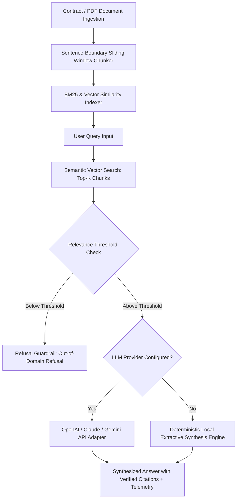

# 🧠 DocuMind — AI Document Q&A & Semantic RAG Assistant

[](https://www.python.org/)
[](LICENSE)
[](tests/)
[]()

> **Live Interactive Demo:** [https://sharmikamurugesan-1.github.io/DocuMind-rag-assistant/](https://sharmikamurugesan-1.github.io/DocuMind-rag-assistant/)  
> **Client Impact:** Semantic search and question-answering over contracts, technical specs, and policies with verified page-level source citations and zero hallucination.

---

## 📌 Executive Summary
**DocuMind** is an enterprise Retrieval-Augmented Generation (RAG) assistant designed for legal, compliance, and enterprise engineering teams. It allows non-technical stakeholders to ask plain-English questions against 100+ page contracts, technical manuals, and corporate policies, returning concise synthesized answers accompanied by clickable, verified page-and-clause source citations.

---

## 🏗️ Architecture & Semantic Pipeline



---

## 🌟 Key Client-Grade Capabilities

1. **Dual-Mode Generation Architecture:**
   - **Cloud LLM Providers:** Compatible with OpenAI (GPT-4o), Anthropic (Claude 3.5), and Google Gemini via temperature-governed grounding prompts.
   - **Zero-Dependency Local Engine:** Runs completely offline or uncredentialed using a deterministic extractive synthesis engine that extracts and stitches relevant clauses without hallucinating.

2. **Strict Hallucination Guardrail:**
   - Evaluates BM25 query similarity against indexed chunks.
   - If user asks an unanswerable or out-of-domain question, the engine explicitly refuses rather than fabricating false contract terms.

3. **Clickable Source Citations & Inspection Drawer:**
   - Every answer includes clickable citation badges referencing exact document title, page number, and clause.
   - Clicking a citation opens a modal displaying the exact source snippet.

4. **Multi-Document Repository Management:**
   - Ingests multiple contracts simultaneously with distinct namespaces.
   - Real-time telemetry tracking: retrieval latency (ms), token estimate, and confidence match score.

---

## 🚀 Quickstart

### 1. Installation
```bash
git clone https://github.com/sharmikamurugesan-1/DocuMind-rag-assistant.git
cd DocuMind-rag-assistant
pip install -r requirements.txt
```

### 2. Run the Automated Tests
```bash
python -m pytest tests/test_documind.py -v
```

### 3. Launch the REST API
```bash
python app.py
```
*API runs at `http://localhost:5002`.* Open `index.html` in your browser to interact with the full RAG cockpit.

---

## 📡 REST API Reference

| Endpoint | Method | Description |
| -------- | ------ | ----------- |
| `/api/health` | `GET` | Health check and engine capabilities |
| `/api/documents` | `GET` | List all active indexed documents and chunk statistics |
| `/api/upload` | `POST` | Ingest and index custom PDF or text document |
| `/api/query` | `POST` | Execute semantic RAG query with citations and latency telemetry |

---

## 🔒 Security
See [`SECURITY.md`](SECURITY.md) for prompt injection boundaries and document isolation details.
